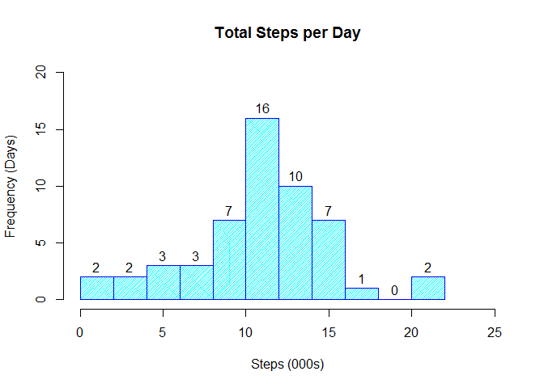
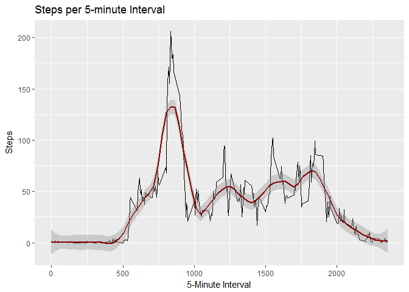
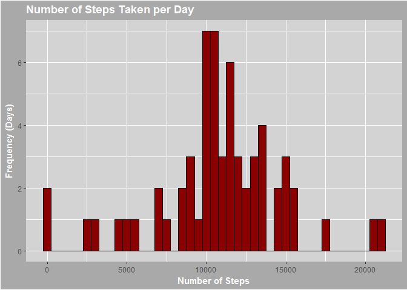
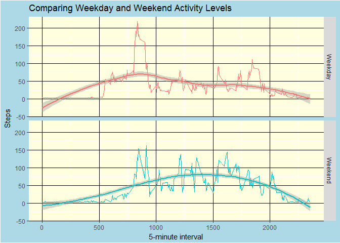

# ReproducibleResearch
Brett Wiens  
September 28, 2017  


## Download and copy the data

The first stage of this assignment is to download the data (as a .zip file) from the source: [https://d396qusza40orc.cloudfront.net/repdata%2Fdata%2Factivity.zip].  Once it has been downloaded into the working directory, it needs to be unzipped and extracted and read into a data.frame in R.


```r
source <- "https://d396qusza40orc.cloudfront.net/repdata%2Fdata%2Factivity.zip"
target <- "ActivityData.zip"
download.file(source, target)
unzip(target)
activityData <- read.csv("activity.csv", stringsAsFactors = FALSE)
```

## Analysis of Daily Step Counts

The second stage of this assignment is to create a histogram of the total number of steps taken each day, then to report the median and the mean number of steps taken each day.


```r
## Aggregate the toal number of steps every day
dailySteps <- aggregate(steps ~ date, activityData, sum)

## Construct a histogram ** Note: To make the labels clearer, I divided total steps by 1000 **
hist(dailySteps$steps/1000, breaks = 10, xlab = "Steps (000s)", ylab = "Frequency (Days)", main = "Total Steps per Day", border = "blue", col = "cyan", density = 50,labels = TRUE, ylim = c(0,20), xlim = c(0,25))
```

<!-- -->

```r
## Calculated the mean and median steps per day
medianSteps <- median(dailySteps$steps)
meanSteps <- mean(dailySteps$steps)
```

The median number of steps taken per day is 10765 and the mean number of steps is 1.0766189\times 10^{4}.

## Time Intervals

The third stage of this assignment is to identify during what time of day one generally observes the highest number of steps.  First we will create a chart showing each five-minute span.  For fun, we include a loess smooth line to demonstrate the trend, and to smooth out some of the rougher sections.


```r
## I wanted to try to find out the actual time of day in which these intervals occurred (I used this later
## in the in-line comments)
activityData$fulltime <- as.POSIXct(activityData$date) + activityData$interval 

## Aggregate the average number of steps by interval
averageInterval <- aggregate(steps ~ interval, activityData, mean)

## Create a plot of average number of steps by interval
IntervalPlot = ggplot(averageInterval, mapping = aes(interval, steps))
## ** Note: I added a smoothing line for some extra fan. **
IntervalPlot + geom_line() + geom_smooth(method = 'loess', span = 0.2, col = "darkred") + labs(title = "Steps per 5-minute Interval", x = "5-Minute Interval", y = "Steps")
```

<!-- -->

Generally speaking, the most steps occur in the 167th 5-minute interval, which is the 835th minute in the day.  Or around 13:55:00.

## Imputing missing data.

The fourth stage of the assignment is to remove some of the bias introduced by the presence of missing days and missing intervals.  We will calculate the number of missing values in the dataset, devise a strategy for filling missing values, effect that strategy, and make a new histogram of the mean and median steps taken per day.  The strategy that we are going to employ is calculating the average of the average number of steps for that day of the week and the average number of steps for that interval.


```r
missingData <- sum(is.na(activityData$steps))
## Calculated the day of the week (helpful in the next part of the exercise, and I used it as part of my missing
## fill strategy)
activityData$dayofweek <- wday(as.Date(activityData$date, '%Y-%m-%d'), label = TRUE)

## Aggregated the average number of steps by day of the wekk.
dailyMean <- aggregate(steps ~ dayofweek, activityData, mean)

## Merged the daily step average (day of the week) as well as the interval average calculated earlier (all = TRUE
## is necessary to keep the NA values)
Imputer <- merge(x = activityData, y = dailyMean, by = "dayofweek", all = TRUE)
Imputer <- merge(x = Imputer, y = averageInterval, by = "interval", all = TRUE)
## My fill strategy is an average of similar weekday steps and similar interval steps
Imputer$averageDayIntervalSteps <- (Imputer$steps.y + Imputer$steps)/2

## Sorted (arranged) the Imputer by date, since it gets all wonky
suppressWarnings(Imputer <- dplyr::arrange(Imputer, date))
suppressWarnings(Imputer$steps.x[is.na(Imputer$steps.x)] <- Imputer$averageDayIntervalSteps)
FullDataset <- Imputer[order(as.Date(Imputer$date, "%Y-%M-%d")),]
FullDataset <- FullDataset[,c(4,1,2,3)]
FullDataset <- dplyr::arrange(FullDataset, date)
names (FullDataset) <- c("Date", "Interval", "DayoftheWeek","Steps")

## Aggregate the sum of steps by date
AllDay <- aggregate(Steps ~ Date, FullDataset, FUN = sum)

## Calculation of the mean and median from the AllDay dataset
MeanDay <- mean(AllDay$Steps)
MedianDay <- median(AllDay$Steps)

## Create the number of steps histogram.  (I'm playing with themes to increase my understanding)
FullDataHistogram <- ggplot(AllDay, mapping = aes(Steps))
FullDataHistogram + geom_histogram(fill = "darkred", col = "black", binwidth = 500) + labs(title = "Number of Steps Taken per Day", x = "Number of Steps", y = "Frequency (Days)") + theme(panel.background = element_rect(fill = "lightgrey"), plot.background = element_rect(fill = "darkgrey"), title = element_text(colour = "white", face = "bold"))
```

<!-- -->

It is clear that imputing missing data affects the results of our analysis.  The mean daily steps are 1.0765747\times 10^{4} and the median daily steps are 1.0765\times 10^{4}.  If you recall, that compares to 1.0766189\times 10^{4} and 10765.  Respectively a difference between means of -0.4416594 and medians of 0.

## Comparing Weekdays and Weekends

It seems logical that activity levels will depend on whether the test subject is working (weekday) or playing (weekend).  The last part of the assignment asks that we compare the two.


```r
FullDataset$WeekendFlag <- "na"
FullDataset$WeekendFlag[grep("Sun|Sat", FullDataset$DayoftheWeek)] <- "Weekend"
FullDataset$WeekendFlag[grep("na", FullDataset$WeekendFlag)] <- "Weekday"
Weekend <- FullDataset[FullDataset$WeekendFlag == "Weekend",]
Weekday <- FullDataset[FullDataset$WeekendFlag == "Weekday",]
WeekendIntervalAverage <- aggregate(Steps ~ Interval, Weekend, mean)
WeekendIntervalAverage$Flag <- "Weekend"
WeekdayIntervalAverage <- aggregate(Steps ~ Interval, Weekday, mean)
WeekdayIntervalAverage$Flag <- "Weekday"
CombinedWeek <- rbind(WeekdayIntervalAverage, WeekendIntervalAverage)

WeekendPlot <- ggplot(CombinedWeek, mapping = aes(Interval, Steps, col = Flag)) + geom_line() + facet_grid(Flag ~ .) + geom_smooth(method = "loess") + labs(title = "Comparing Weekday and Weekend Activity Levels", x = "5-minute interval") + theme(legend.position = "none", panel.background = element_rect(fill = "lightyellow"), panel.grid.major = element_line(colour = "black"), plot.background = element_rect(fill = "lightblue"))
WeekendPlot
```

<!-- -->
